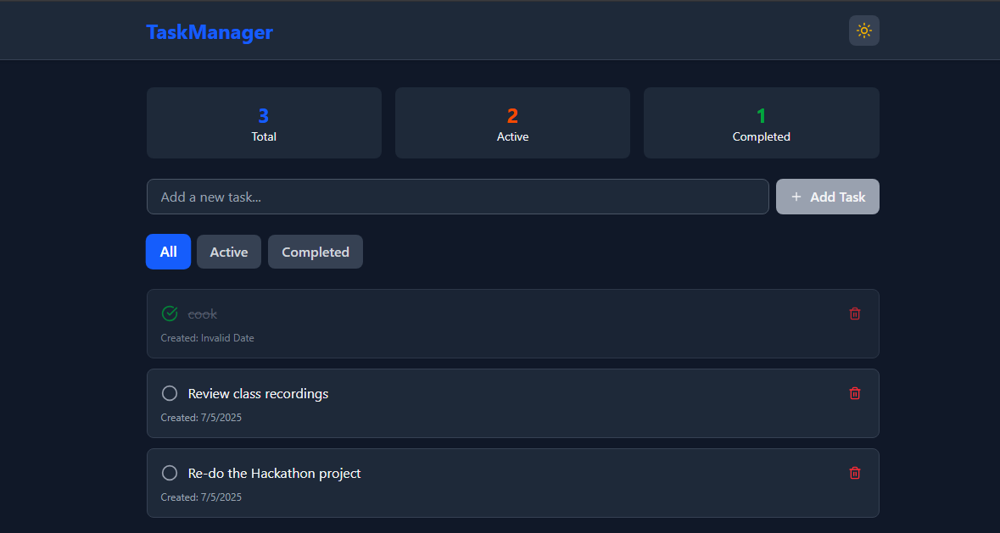

# 📝 Task Manager App

A simple and responsive task management application built with **React** and **Tailwind CSS**. It allows users to add, filter, and manage tasks with theme toggling and local storage persistence.

---

## 🚀 Features

- ✅ Add new tasks with a form
- 🧠 Filter tasks by status (all / completed / active)
- 📊 View task statistics (total, completed, pending)
- 🌗 Toggle between light and dark themes
- 💾 Persist tasks using `localStorage`
- ⚡ Responsive and fast thanks to Vite and Tailwind

---

## 📁 Project Structure

```
src/
│
├── components/           # Reusable UI components
│   ├── Header.jsx
│   ├── TaskForm.jsx
│   ├── TaskList.jsx
│   ├── FilterButtons.jsx
│   └── TaskStats.jsx
│
├── contexts/             # Theme context for light/dark mode
│   └── Themecontext.js
│
├── hooks/                # Custom hooks
│   └── useLocalStorage.js
│
├── App.jsx               # Root component
├── main.jsx              # App entry point
└── index.css             # Tailwind CSS styles
```

---

## 🛠️ Tech Stack

- React (via Vite)
- Tailwind CSS
- Lucide React Icons
- Local Storage API

---

## 🧑‍💻 Getting Started

### 1. Clone the repo or download this zip

```bash
git clone https://github.com/your-username/task-manager-app.git
cd task-manager-app
```

### 2. Install dependencies

```bash
pnpm install
```

> or use `npm install` or `yarn` depending on your package manager

### 3. Run the development server

```bash
pnpm dev
```

Then open [http://localhost:5173](http://localhost:5173) in your browser.

---

## 📦 Build for production

```bash
pnpm build
```

---
## App Preview




## 📄 License

This project is open source and available under the [MIT License](LICENSE).
